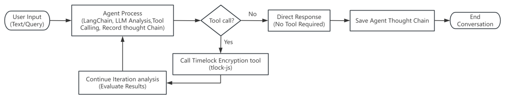
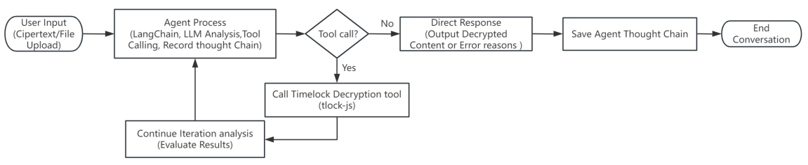

# Timelock Showcase

## Features

**1. Agent Thought Chain**

Any conversation with the agent, the internal thought chain will be recorded.

**2. Encrypting Specified Text with Timelock**

The agent can utilize the timelock encryption tool to encrypt specified text. You may also set the desired encryption duration; if not specified, the default duration is 5 minutes.

**3. Automatic Encryption of Thought Chain**

Upon the conclusion of a conversation, the agent's thought chain is automatically encrypted with a 5-minute timelock and saved locally as a txt file.

**4. Decrypting the Cipertext**

When it's time to decrypt, you can provide the ciphertext to the agent or upload the thought chain's ciphertext file (only .txt files are permitted). The agent will then use the timelock decryption tool to decrypt the content. 

*(Please note that if the specified decryption time has not yet been reached, decryption will not be successful.)*

## Core Dependencies

### LangChain
A framework for developing applications powered by language models. LangChain provides tools and abstractions for working with AI models, enabling the creation of context-aware, reasoning-based applications.

LangChain simplifies the process of chaining together multiple AI operations, managing prompts, and integrating with external data sources, making it ideal for building complex AI workflows and agents.

### tlock-js
A TypeScript library for encrypting data which can only be decrypted at a set time in the future using drand.

tlock-js uses AGE to symmetrically encrypt a payload, and encrypts the symmetric key using pairing-based cryptography ensuring that it can only be decrypted when the drand's threshold network has generated randomness at a future point.

### LLM
The llm (OpenAI/DeepSeek/Grok...) is used as an assistant, and also decides the overall conversation and task execution process.

## Workflow

#### Encryption Process Flow


Input: Use the time lock encryption tool to encrypt the text "Let's meet at Starbucks tomorrow at ten o'clock", and set the encryption time to 2 minutes. Output the encrypted ciphertext.

Agent: 




#### Decryption Process Flow

Input: Use the time lock decryption tool to decrypt the whole content "[cypertext]"

Agent:


## How to use

### Environment

- Node.js (v22.7 or higher recommended)
- yarn package manager

### Configuration

Use the `config.ts` file for configuration.

#### Configuration Steps

1. Copy the `config.example.ts` file and rename it to `config.ts`
2. Fill in your API keys and other configuration information in the `config.ts` file

#### Configuration Options

- `OPENAI_API_KEY`: OpenAI API key
- `OPENAI_MODEL`: OpenAI model to use, defaults to 'gpt-3.5-turbo'
- `OPENAI_BASE_URL`: Base URL for OpenAI API
- `TAVILY_API_KEY`: Tavily search API key


### Installation and Running

```bash
# Install dependencies using yarn
yarn install

# Build the application
yarn build

# Start the production server
yarn start

# Project will running on http://localhost:3000
```

